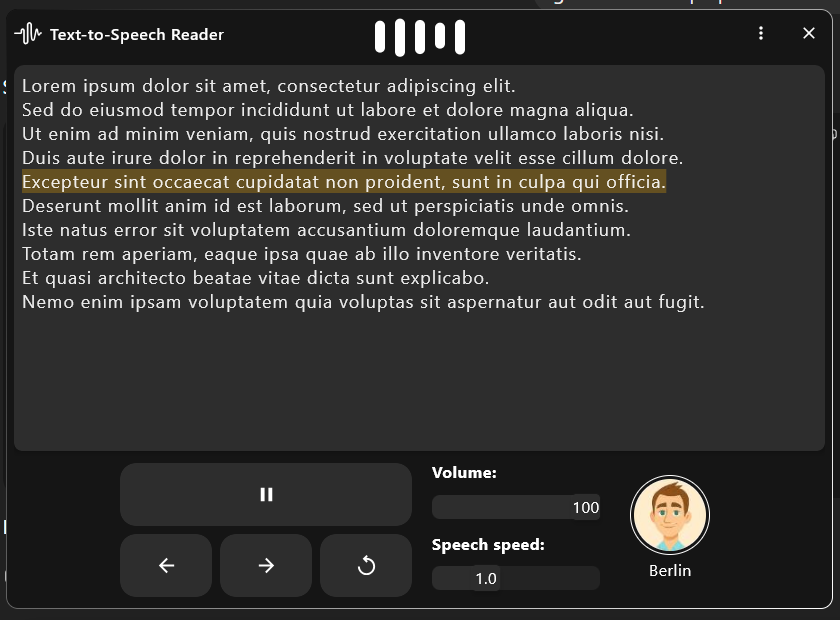
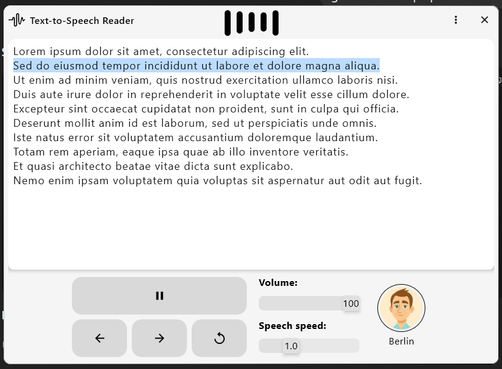

# TtsReader 🗣️ | Smart Offline Text-to-Speech Reader

**TtsReader** is a cross-platform, offline TTS app built with **Kotlin Multiplatform** and **Jetpack Compose**, using the **[Kokoro TTS model](https://huggingface.co/hexgrad/Kokoro-82M)** through **[sherpa-onnx](https://github.com/k2-fsa/sherpa-onnx)** via **JNI**. It offers intelligent sentence-by-sentence speech with real-time highlighting — no internet or cloud required.

---

<p align="center">
  
  &nbsp;
  
</p>
---

## ✨ Key Features

- 🖥️ **Kotlin Multiplatform Desktop App** (Jetpack Compose UI)
- 🎤 **Offline TTS** using Kokoro + sherpa-onnx + JNI
- 📖 **Smart Sentence Playback**: one sentence at a time with buffering
- 🔦 **Live Highlighting**: currently spoken sentence is highlighted
- 🌐 **Chrome Extension Support**:
  - Right-click selected text → “Play with TtsReader”


## 🚀 Getting Started


### 📦 Windows Installer

Download the prebuilt `.msi`:

* [TtsReader.msi (75.9 MB)](https://github.com/ys-pro-duction/TtsReader/releases)
* SHA-256: `5177f1ae811422b540e672232fb33ac63eb57114c9ecd005d2e24dc99e6353cd`

---
### 🔧 Requirements

- JDK 17+
- Git
- Chrome (for browser extension)

### 🛠 Run from Source

```bash
git clone https://github.com/ys-pro-duction/TtsReader.git
cd TtsReader
./gradlew run
````


## 🌐 Chrome Extension

Optional browser extension for sending selected text to the desktop app.

### Install Instructions

1. Download: [chrome-extension.zip](https://github.com/ys-pro-duction/TtsReader/releases)
2. Extract it
3. Open Chrome → `chrome://extensions`
4. Enable **Developer Mode**
5. Click **“Load unpacked”** → select extracted folder
6. Select text on any webpage → right-click → **“Play with TtsReader”**

TtsReader desktop app must be running in the background.

---

## 🎙️ How It Works

* Text is broken into sentences using punctuation
* The app:

    * **Plays 1 sentence at a time**
    * **Buffers the next 2 sentences** for seamless delivery
    * **Highlights the active sentence** in the UI
* Playback uses native **Kokoro ONNX** models via **JNI**

---

## 📦 Models

First launch will download required models to:

```
~/.TtsReader/
├── model.onnx
├── tokens.txt
├── config.json
```

---


**TtsReader** — Read your text aloud, smoothly and intelligently, all offline.

